<p align="center">
  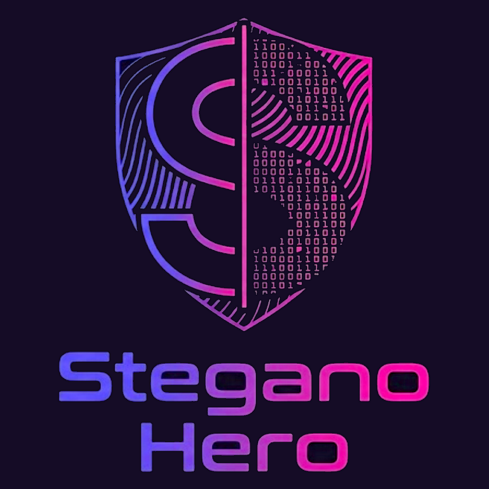
</p>

<p align="center">
  
  
  
  
  
  
</p>

# SteganoHero

Text provenance and traceability for documents and feeds. Software by Hope 'n Mind.

At its core, SteganoHero hides text inside text and encrypts what it hides, so a secret can travel inside a plain email. It also establishes where a document came from, proves who authored it, traces a leaked copy back to the person it was issued to, and keeps your own files clean. It is built on one principle: honesty over hype. Every result states what it can prove and names what it cannot.

<table>
  <tr>
    <td>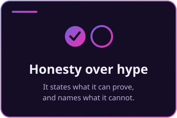</td>
    <td>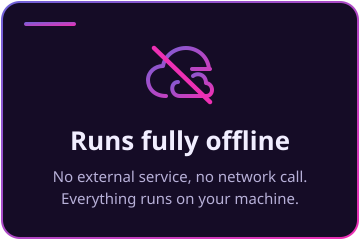</td>
    <td>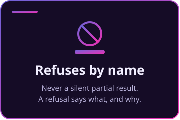</td>
  </tr>
</table>


<a id="hide-and-encrypt"></a>


Place a hidden layer inside an ordinary-looking text, sealed first with strong encryption, and send it inside a plain email. Two independent protections: it is hidden, and what is hidden is encrypted.

<p align="center">
  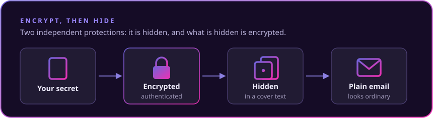
</p>

<table>
  <tr>
    <td>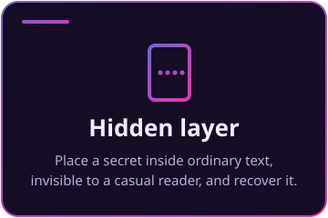</td>
    <td>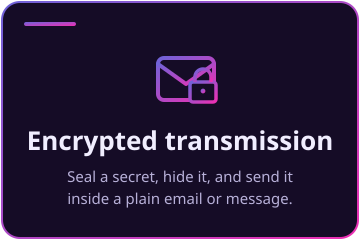</td>
    <td>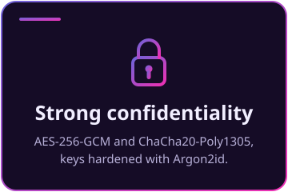</td>
  </tr>
</table>

 **Encrypt, then hide.** Before a secret is placed, it is sealed with authenticated encryption: AES-256-GCM or ChaCha20-Poly1305, with the key derived from your passphrase through Argon2id, a memory-hard function. Authenticated means any tampering is detected, never silently accepted.

 **Send it as plain text.** The marked cover is ordinary text. Paste it into an email, a message, or a document, and the encrypted secret travels inside it, past readers and filters that only see words. Placement never touches code spans, fenced blocks, or equations, so those stay byte-identical.

 **Decode and decrypt.** The recipient recovers the hidden layer and, with the passphrase, opens it. Without the passphrase, the layer is unreadable.

 **Or seal to a recipient, with no shared password.** Instead of a passphrase, a secret can be sealed to a recipient's public key. Generate a keypair, share the public half, and anyone can seal a secret only your secret key opens. The sealed secret then hides inside a plain cover text exactly like any other, so an encrypted-to-you message travels inside an ordinary email with nothing shared in advance.

 **Post-quantum, stated honestly.** The recipient seal uses post-quantum key protection (ML-KEM-768, a lattice scheme a quantum computer does not break) wrapped around authenticated AES-256-GCM, so the key exchange resists a future quantum adversary and any tampering is detected. The passphrase mode is symmetric with a strong AES-256 margin and no public-key exchange to break. A wrong key, a truncated payload, or any tampering is refused by name, never a partial result.

 **No weak link by construction.** A passphrase key comes from a memory-hard derivation, so it is not cheap to brute-force, and no cipher here hides a small, enumerable keyspace. The tests prove the round-trip, the tamper detection, the recipient seal and open, and the absence of a small keyspace, not an impossible promise of unbreakability.

<p align="center">
  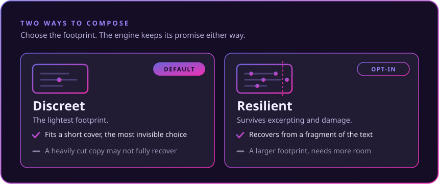
</p>

Composing is discreet by default: the lightest footprint, the choice that fits a short cover and stays the most invisible. When a marked copy has to survive being excerpted or partly damaged, a resilient mode is one opt-in away, trading a larger footprint for recovery from a fragment. Either way the capacity shown is the figure the engine accepts, and a shortfall refuses by name rather than overrunning the cover.


<a id="saturation"></a>


The aggressive variant of concealment. Instead of placing the secret once, it repeats the secret to fill the carrier's channel to the cover's full capacity, so the cover carries as much as it can hold. An opt-in, reported for exactly what it is.

<p align="center">
  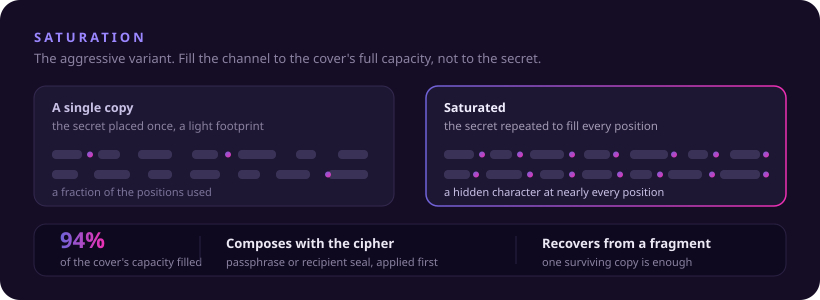
</p>

 **Fills to the cover's capacity.** On a 425-word cover it places a hidden character at 864 of the 924 positions the cover offers, where a single placement uses a fraction of that. A test pins that saturation fills the channel to within one copy of the cover's full capacity, never one copy sized to the secret.

 **One channel or several, stacked.** Choose a single channel or several. Each is saturated independently, so a stack is multi-method saturation, each one an independent, redundant channel.

 **Still encrypted.** Saturation is applied after confidentiality, so it composes with the passphrase cipher and the recipient seal exactly like a single placement.

 **Recovers from a fragment.** The redundancy is the point: a document cut to a fragment still recovers, as long as one whole copy survives.

 **The visible text is untouched.** Stripping the channel returns the cover byte-for-byte. Only invisible characters were added, and the density is reported with the verdict the analyser would return.


<a id="any-input-any-output"></a>


Every operation takes what you have and gives back what you need. A function that reads text reads a real document just as well, and a result you can copy is a result you can save.

<p align="center">
  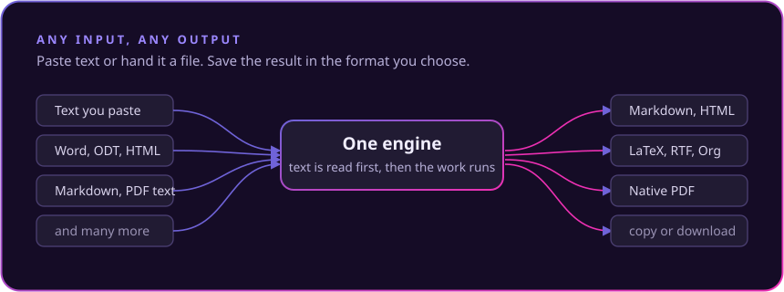
</p>

 **Text or a file, everywhere.** Paste text, or hand an operation a document (Word, OpenDocument, HTML, Markdown, plain text, a PDF's text layer, and more): its text is extracted first, then the operation runs. The same file input works on every surface, so reading a marked document back is as easy as marking one.

 **Copy or download, in the format you choose.** Any result exports to a document you can save: Markdown, HTML, plain text, LaTeX, RTF, Org, reStructuredText, AsciiDoc, Jupyter, Typst, and a self-contained native PDF. Plain text and Markdown are byte-faithful, so a marked cover exported to them keeps its hidden layer; the richer formats are a declared-lossy rendering, and PDF states plainly that a hidden layer does not survive it.

 **Built on an honest converter.** The document writers reuse the format engine of [MD-to-ALL](https://github.com/hopenmind/mdall), Hope 'n Mind's Markdown converter, kept pure-Rust and offline and adapted to preserve every character where a hidden layer depends on it.


<a id="provenance-and-control"></a>


Establish where a document came from, prove who authored it, trace a leaked copy back to its recipient, read the AI-origin signals a text carries, and keep your own files clean.

<table>
  <tr>
    <td>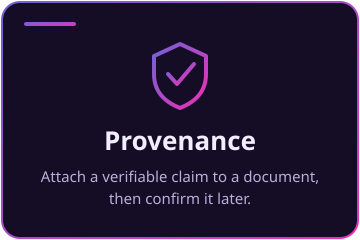</td>
    <td>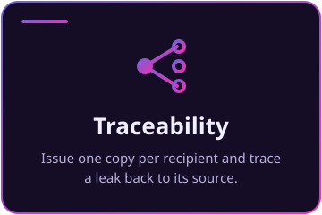</td>
    <td>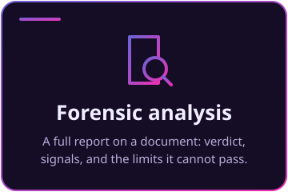</td>
  </tr>
  <tr>
    <td>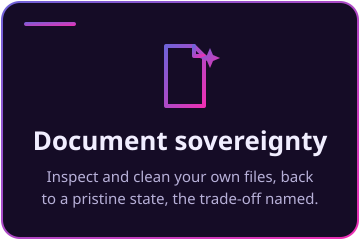</td>
    <td>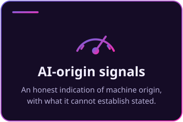</td>
    <td>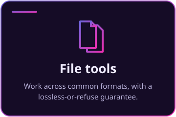</td>
  </tr>
</table>


<a id="architecture"></a>


One self-contained Rust workspace. The same capabilities reach you four ways, and all four dispatch through a single validated command catalogue, so a field set, a validated range, or a refusal message is identical on every surface.

<p align="center">
  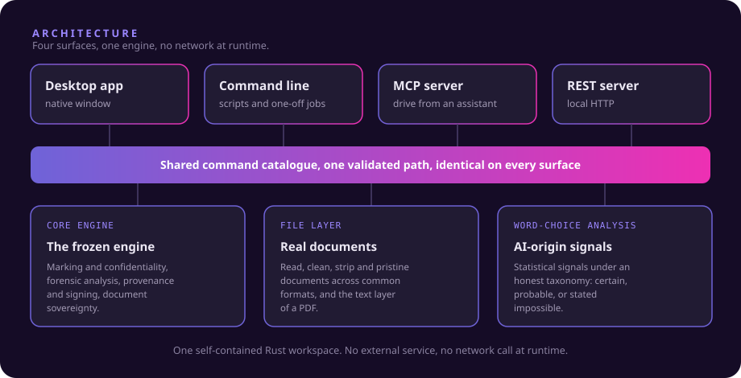
</p>

Underneath sits the engine, split into focused crates:

| Crate | Role |
|---|---|
| Core engine | The frozen engine: marking and confidentiality, forensic analysis, provenance and signing, and the safe document-sovereignty operations. Nothing above it reimplements its logic. |
| File layer | Reads real documents, extracts their text, and writes results back in the original format. It ties inspect, clean, strip and pristine to files across common formats, and reads the text layer of a PDF. |
| Word-choice analysis | The statistical layer: AI-origin signals reported under an honest verdict taxonomy, with the structural limits stated on every report. |
| Surface crates | The desktop app, the command line, the assistant-facing server, and the HTTP server. Each is a thin driver over the shared catalogue; none owns engine logic. |

The desktop app talks to the engine in-process, so it needs no server and no browser. There is no external service and no network call at runtime.

<p align="center">
  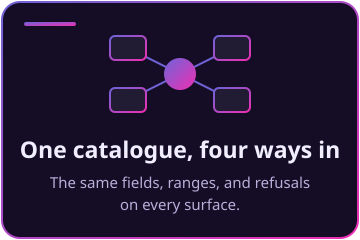
</p>


<a id="capabilities"></a>


The whole catalogue, grouped into families. Every command that can refuse does so by name (an empty input, a capacity shortfall with its arithmetic, an unknown option), never a silent partial result. File payloads pass their bytes with a format hint.

<p align="center">
  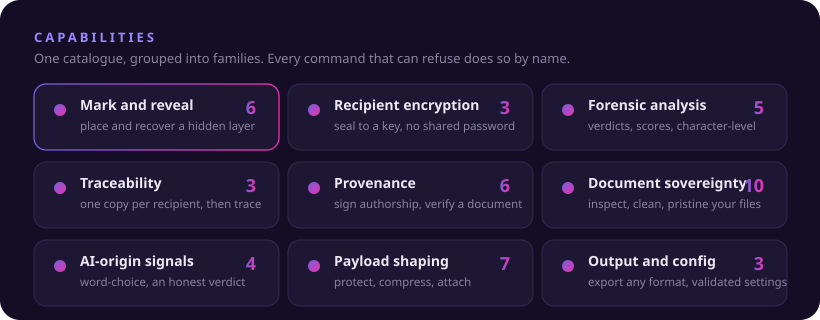
</p>

<a id="mark-and-reveal"></a>


Place a hidden layer, and recover it. Confidentiality is optional and applied before placement; a mission caps how much of the cover a layer may fill.

| Command | What it does |
|---|---|
| `conceal` | Place a hidden layer inside a cover text. Placement never writes inside code spans, fenced blocks, or equations, so a marked document keeps its code and its maths byte-identical. |
| `reveal` | Recover a hidden layer from a text, or from a marked document file. |
| `capacity_report` | Report how much a cover text can carry, before you commit. |
| `roundtrip_check` | Test a plan against a cover text without writing anything. |
| `chain_validate` | Check that a selection of placement channels is legal before composing. |
| `capabilities_list` | List the live channels, confidentiality layers, missions, and the full command set. |

Confidentiality comes two ways: a passphrase-derived authenticated cipher, or a seal to a recipient's public key with no shared password. Two laboratory reference layers exist for study only and are labelled as providing no authentication. A mission (conceal, sign, or mark) caps how much of the cover a layer may fill, so a marked text does not read as tampered.

<a id="recipient-encryption"></a>


Seal a secret to a recipient's public key. The result hides inside a cover text like any other.

| Command | What it does |
|---|---|
| `pqc_keypair` | Generate a recipient keypair. Keep the secret half; publish the public half. |
| `pqc_seal` | Seal a secret to a recipient's public key. The result hides inside a cover text like any other secret. |
| `pqc_open` | Open a payload sealed to you with your secret key. A wrong key or any tampering is refused by name. |

Sealing to a recipient uses post-quantum key protection wrapped around authenticated encryption, and conceal and reveal take a recipient key directly, so hiding an encrypted-to-someone secret is one step.

<a id="forensic-analysis"></a>


Report what a text carries, with the certain findings separated from the probable.

| Command | What it does |
|---|---|
| `analyze` | The full report on a text: an overall verdict, a suspicion score, the signals present, and a character-level breakdown, with the certain findings separated from the probable. |
| `inspect` | Report the marks a text carries, by class and count, without opening the hidden layer. |
| `detect` | A quick detection pass. |
| `measure_text` | Score a text. |
| `compare_texts` | Compare two texts. |

<a id="traceability"></a>


One marked copy per recipient, identical to the eye, and a leaked copy traced back to the recipient it was issued to.

<p align="center">
  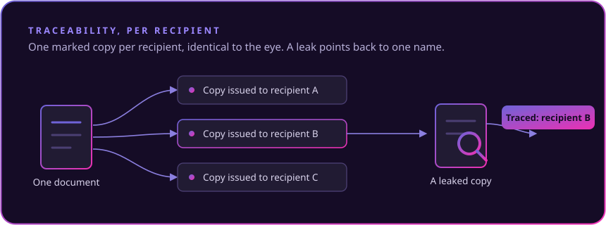
</p>

| Command | What it does |
|---|---|
| `mark_batch` | Produce one marked copy of a document per recipient, each visually identical, plus a registry. |
| `trace_origin` | Identify which recipient a leaked copy was issued to. |
| `verify_mark` | Check a text against one named recipient. |

<a id="provenance-authorship"></a>


Attach a verifiable claim to a document, and verify it later. Trust is reported exactly as the check returns it.

| Command | What it does |
|---|---|
| `provenance_sign` | Attach a verifiable provenance record to a document: human authorship, an AI-generation disclosure, an integrity seal, a recipient fingerprint, as a detached sidecar or carried inside the document. |
| `provenance_verify` | Verify a document's provenance. Trust is reported exactly as the check returns it. |
| `authorship_keypair` | Create an authorship key pair. |
| `authorship_sign` | Attach an authorship claim to a text. |
| `authorship_verify` | Check an authorship claim. |
| `c2pa_inspect` | Read the content credential a file carries, and report exactly what a conformant reader returned. |

<a id="document-sovereignty"></a>


Inspect, clean, and take your own files to a pristine state, in their original format, each operation naming its trade-off.

| Command | What it does |
|---|---|
| `document_inspect` | Inspect your own text for marks, by class. |
| `document_clean` | Remove the mark classes you choose from your own text. |
| `document_pristine` | Return your own text to a fully pristine state (every mark class and every remaining invisible), a declared opt-in that names its trade-off and reports what it removed. |
| `file_inspect` | Inspect a document file for the marks it carries. |
| `file_clean` | Clean the chosen mark classes from a file and return it in its original format, lossless where it can be proven and refused by name where it cannot. |
| `file_strip` | Remove a file's metadata (native and any added channel) with the readable content left byte-identical. |
| `file_pristine` | Return a text file to a fully pristine state. |
| `file_analyze` | The full forensic report over a document file's own text. |
| `file_metadata` | Read the standard metadata a document or image carries. |
| `file_convert` | Convert a file to another format. Declared lossy, and it never places a mark. |

<a id="ai-origin-signals"></a>


Analyse the word choices in a text under an honest verdict, and name the limit it cannot pass.

| Command | What it does |
|---|---|
| `wordmark_analyze` | Analyse the word choices in a text and report an honest verdict (certain, probable, indication) alongside the plain statement of the limit it cannot pass. |
| `wordmark_scrub` | A best-effort local perturbation of the wording. It reports what it changed and never claims removal. |
| `wordmark_rewrite` | An assisted rewrite through a model you choose, local or online. An online send is an explicit, labelled step, followed by a local re-clean. |
| `wordmark_online_disclaimer` | Return the disclaimer an online rewrite must show first, in the caller's language. |

<a id="payload-shaping"></a>


Protect, compress, and attach a payload before it is placed.

| Command | What it does |
|---|---|
| `protect_payload` / `unprotect_payload` | Protect a payload, and open a protected one. |
| `compress_payload` / `expand_payload` | Compress a payload, and expand it. |
| `attach_payload` / `list_attachments` / `detach_payload` | Attach a file to a text, list attachments, and remove them. |

<a id="output-configuration"></a>


Export any result to the format you choose, and read or update the runtime configuration with every value validated on write.

| Command | What it does |
|---|---|
| `export` | Export any text result to a document to save: Markdown, HTML, plain text, LaTeX, RTF, Org, reStructuredText, AsciiDoc, Jupyter, Typst, or a native PDF. Plain text and Markdown are byte-faithful; the rest are a declared-lossy rendering. |
| `render` | Render output ready to redistribute. |
| `settings_read` / `settings_update` | Read the runtime configuration, and update it with every value validated on write. |

Any operation that reads text also accepts a document file (its text is extracted first), on every surface. The desktop shows a format picker and a download beside every result, so what you can copy you can also save.


<a id="desktop-app"></a>


One window, a tab per task, and no network at runtime. Theme (system, light, dark) and language live in the top bar; every string is translated.

<p align="center">
  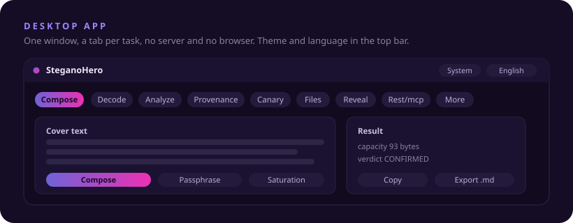
</p>

| Tab | What you do there |
|---|---|
| Compose | Place a hidden layer inside a cover text, encrypt it with a passphrase or seal it to a recipient's public key, set a mission and density, and see the capacity and the verdict the analyser would return. Export the result in any format. |
| Decode | Quick reveal of a hidden layer, from pasted text or a marked file, open a payload sealed to you, generate your recipient keypair, and recover a file hidden in a document. |
| Analyze | The forensic report on a text. |
| Provenance | Sign a document with a composable claim, and verify a document's provenance. |
| Canary | Generate one marked copy per recipient plus a registry, then trace a leaked copy back to its recipient. |
| AI-regulation | Inspect and clean your own document, take it to a pristine state, read a content credential, and analyse or perturb its word choices. |
| Files | Run the safe tools on a real file: inspect, clean, strip, pristine, and get the file back in its original format. |
| Reveal | The traced decoder: the reveal shown wave by wave in reverse order, each wave with its verdict, and a recovery mode that is declared, never silent. |
| Settings | The runtime engine configuration, validated as you write it. |
| Rest/mcp | Point an assistant client at the MCP server in one click, see the REST endpoint, and copy the config snippet for any other client. |
| About | Version, build, contact. |


<a id="connect-assistant"></a>


The same command catalogue is an MCP server, so an assistant client can drive every capability, offline, over stdio or HTTP.

<p align="center">
  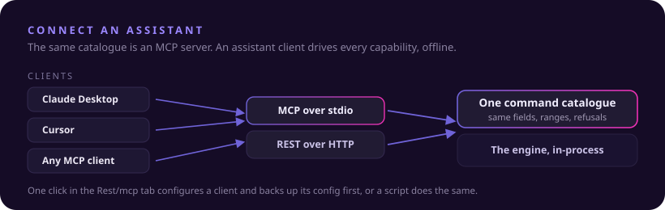
</p>

The desktop app's Rest/mcp tab configures the clients it can write safely (Claude Desktop, Cursor, Windsurf) in one click, backing up each config first and never overwriting it, and shows the exact snippet to paste for any other client. From a terminal, the same setup is a script:

```bash
bash scripts/configure-mcp.sh
```

```bash
pwsh scripts/configure-mcp.ps1
```

Every client is pointed at the `stegano-mcp` binary over stdio; the REST server exposes the identical catalogue over HTTP for clients that speak it.


<a id="install"></a>


Download the installer for your system and run it. The desktop app is self-contained and runs fully offline, with every dependency embedded.

<p align="center">
  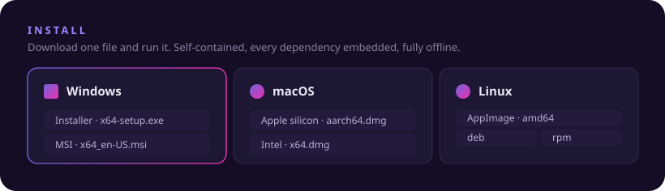
</p>

| System | Download |
|---|---|
| Windows (installer) | [SteganoHero_0.1.2_x64-setup.exe](../../releases/download/v0.1.2/SteganoHero_0.1.2_x64-setup.exe) |
| Windows (MSI) | [SteganoHero_0.1.2_x64_en-US.msi](../../releases/download/v0.1.2/SteganoHero_0.1.2_x64_en-US.msi) |
| macOS (Apple silicon) | [SteganoHero_0.1.2_aarch64.dmg](../../releases/download/v0.1.2/SteganoHero_0.1.2_aarch64.dmg) |
| macOS (Intel) | [SteganoHero_0.1.2_x64.dmg](../../releases/download/v0.1.2/SteganoHero_0.1.2_x64.dmg) |
| Linux (AppImage) | [SteganoHero_0.1.2_amd64.AppImage](../../releases/download/v0.1.2/SteganoHero_0.1.2_amd64.AppImage) |
| Linux (Debian, Ubuntu) | [SteganoHero_0.1.2_amd64.deb](../../releases/download/v0.1.2/SteganoHero_0.1.2_amd64.deb) |
| Linux (Fedora, RHEL) | [SteganoHero-0.1.2-1.x86_64.rpm](../../releases/download/v0.1.2/SteganoHero-0.1.2-1.x86_64.rpm) |

Every build is also on the [release page](../../releases/latest).

To build from source instead, you need a recent Rust toolchain. From the workspace root, `cargo build --workspace --release` produces the desktop app, the command-line tool, and the two servers. The cross-platform installers are built by the release workflow on a version tag (see `.github/workflows/release.yml`).


<a id="honesty-limits"></a>


SteganoHero is built for people who need protection they can trust, so it never sells a guarantee it cannot keep.

<p align="center">
  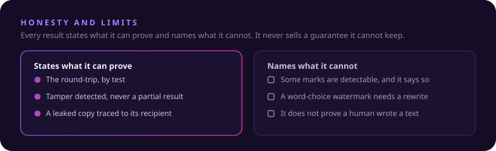
</p>

 Some marks are inherently detectable. Where that is true, the tool says so and never presents them as invisible.

 A statistical, word-choice watermark lives in the wording a model chose, not in the bytes of a file. No byte-level cleaning reaches it. Removing it means rewriting the wording, which changes the text and cannot be guaranteed. The tool states this plainly.

 Cleaning your own files is legitimate document hygiene, the same operation an established metadata cleaner performs. It is for your own content, not a way to pass another's or a machine's authorship off as your own.

 An analysis reports what it can establish and names the limit it cannot pass. It does not prove that a text was written by a human.


<a id="project"></a>


 [SECURITY](SECURITY.md): the security policy and how to report an issue.

 [CONTRIBUTING](CONTRIBUTING.md): how contributions are handled.

 [LICENSE](LICENSE): all rights reserved.

<br>

<p align="center">
  
</p>
<p align="center"><sub>Made by <b>Hope 'n Mind</b></sub></p>
